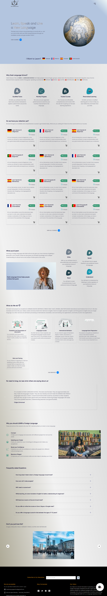
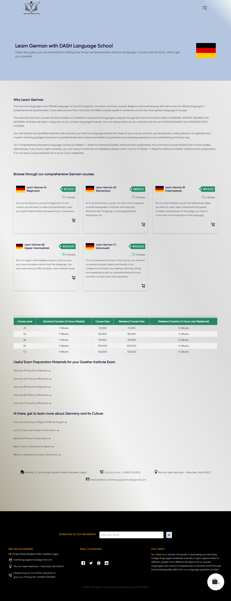
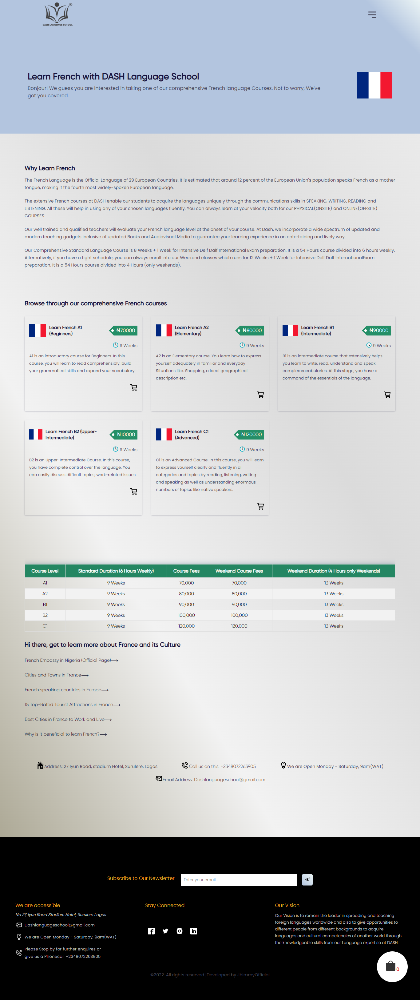
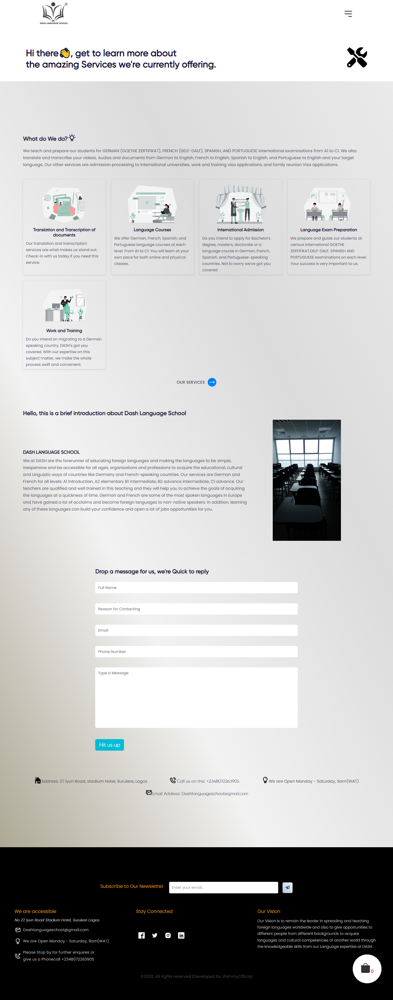

 # Dash Language School - A Language School to learn foreign languages.

The main purpose of this project was to provide a payment and informational platform for a language school with offices in Lagos, Nigeria. This website was created to provide various users with comprehensive information on the four foreign languages the school offers. Using a secure payment gateway, a user can preview a course, choose whether it fits into their schedule, then pay for it ("Paystack").

## Table of contents

- [Overview](#overview)
  - [The Project](#the-project)
  - [Links](#links)
- [My process](#my-process)
  - [Built with](#built-with)
- [Author](#author)

## Overview

### The Project
Major Components of the Project includes
1 Optimal layout for the site depending on user's device's screen size
2 Accordion
3 Payment Gateway
4 Carousel slider for testimonials
5 Interactive form fields
6 Table
7 Add to Cart functionality

### Links

- Live Site URL: https://dashlanguageschool.com

### Images of the project

### Built with

- React.Js
- Redux
- Styled Components
- GSAP
- React Router
- CSS Media Queries
- Mobile-first workflow
- [React Slick](https://react-slick.neostack.com/) For Carousel

## Author

- Twitter - [@jhimmyofficial](https://www.twitter.com/@jhimmyofficial)

## Running the Project

The project was bootstrapped with [Create React App](https://github.com/facebook/create-react-app).

## Available Scripts

In the project directory, you can run:

### `npm start`

Runs the app in the development mode.\
Open [http://localhost:3000](http://localhost:3000) to view it in the browser.